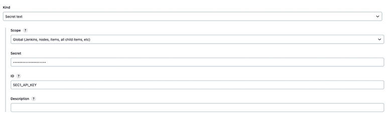
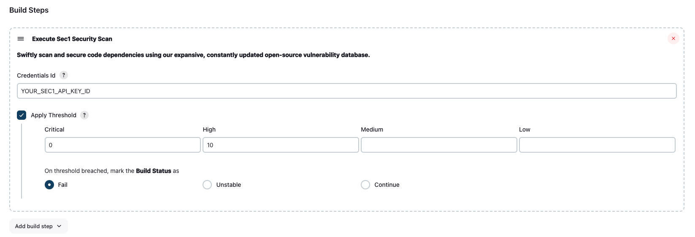

# SEC1 Security

[](https://sec1.io)

## Introduction

SEC1 Security plugin help developers/teams to scan their SCM for open source vulnerabilities against SEC1 Security DB

## Usage
To use the plugin up you will need to take the following steps in order:

1. [Install the SEC1 Security Plugin](#1-install-the-sec1-security-plugin)
2. [Configure a SEC1 API Token Credential](#2-configure-a-sec1-api-token-credential)

## 1. Install the SEC1 Security Plugin

- Go to "Manage Jenkins" > "Manage Plugins" > "Available".
- Search for "SEC1 Security".
- Install the plugin.

### Custom API Endpoints

By default, Sec1 uses the https://api.sec1.io endpoint. 
It is possible to configure Sec1 to use a different endpoint by changing the `SEC1_API_ENDPOINT` environment variable:

- Go to "Manage Jenkins" > "Configure System"
- Under "Global Properties" check the "Environment variables" option
- Click "Add"
- Set the name to `SEC1_API_ENDPOINT` and the value to the custom endpoint


## 2. Configure a SEC1 API Token Credential

- Go to "Manage Jenkins" > "Manage Credentials"
- Choose a Store
- Choose a Domain
- Go to "Add Credentials"
- Select "Secret text"
- Add SEC1_API_KEY as ID and Configure the Credentials

<blockquote>
<details>
<summary>📷 Show Preview</summary>



</details>
</blockquote>

## 4. Add Sec1 Security to your Project

This step will depend on if you're using Freestyle Projects or Pipeline Projects.

### Freestyle Projects

- Select a project
- Go to "Configure"
- Under "Build", select "Add build step" select "Execute Sec1 Security Scanner"
- Configure as needed. Click the "?" icons for more information about each option.

<blockquote>
<details>
<summary>📷 Show Preview</summary>



</details>
</blockquote>

### Pipeline Projects

Use the `sec1Security` step as part of your pipeline script. You can use the "Snippet Generator" to generate the code
from a web form and copy it into your pipeline.

<blockquote>
<details>
<summary>📷 Show Example</summary>

```groovy
pipeline {
  agent any

  stages {
    stage('Build') {
      steps {
        echo 'Building...'
      }
    }
    stage('Sec1 Security') {
            steps {
                script {
                    //Prepare your credentials which will be used to access the SCM url given to scanner
                    //This is optional if your SCM url is public
                    def creds
                    withCredentials([usernamePassword(credentialsId: 'CRED-ID', usernameVariable: 'USERNAME', passwordVariable: 'PASSWORD')]) {
                      creds = "${USERNAME}:${PASSWORD}"
                    }
                    sec1Security (
                        scmUrl: "<SCMURL>", 
                        scm: "<type-of-scm>", //e.g. github
                        accessToken: creds, //you can skip withCredentials and credentialsId as accessToken will take precedence over both
                        credentialsId: "CRED-ID", //if you pass this then you can skip above withCredentials section
                        applyThreshold: true,
                        threshold: [criticalThreshold: '0', highThreshold: '10'],
                        actionOnThresholdBreached: "unstable" //possible values are fail,unstable,continue. default: fail
                    )
                }
            }
        }
    stage('Deploy') {
      steps {
        echo 'Deploying...'
      }
    }
  }
}
```

</details>
</blockquote>
Whether the step should fail if issues and vulnerabilities are found.
You can pass the following parameters to your `sec1Security` step.

#### `scmUrl` (required)

Source code url which you want to scan for vulnerabilities.

#### `scm` (optional, default: `github`)

Type of the scm. e.g. github/bitbucket/gitlab

#### `scm` (optional, default: `github`)

Type of the scm. e.g. github/bitbucket/gitlab

#### `accessToken` (optional, default: *none*)

<username>:<password> for the SCM url. This will overwrite credentialsId if provided.

#### `credentialsId` (optional, default: *none*)

Credentials ID which is configured in Jenkins store which has access on given SCM url

If no accessToken or credentialsId given then credentils configured against the given SCM in users current pipelne config will be used.

#### `applyThreshold` (optional, default: `false`)

Whether vulnerability threshold needs to be applied on the build.

#### `threshold` (optional, default: `false`)

Threshold values for each type of vulerability. e.g. configuration:
[criticalThreshold: '0', highThreshold: '10', mediumThreshold: '0', lowThreshold: '0']

If scan reports gives more vulnerabilities than configured threshold for the respective type of vulnerability then error will be shown in console and build status will be modified based on actionOnThresholdBreached value.

#### `actionOnThresholdBreached` (optional, default: `fail`)

The action which needs to be taken on build if vulnerability threshold is breached. Possible values: `fail`, `unstable`, `continue`

## Troubleshooting

### Increase Logging

To see more information on your steps, you can increase logging and re-run your steps.

- View the "Console Output" for a specific build.

---

Made with 🧡 by Sec1 team